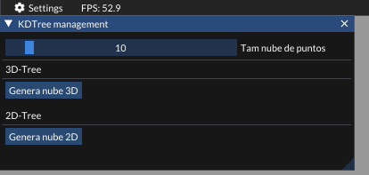
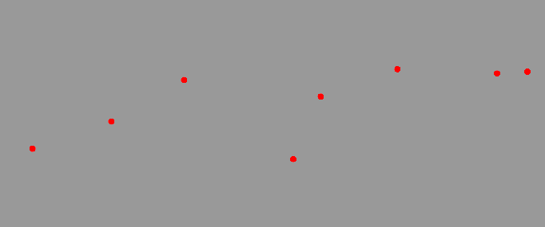
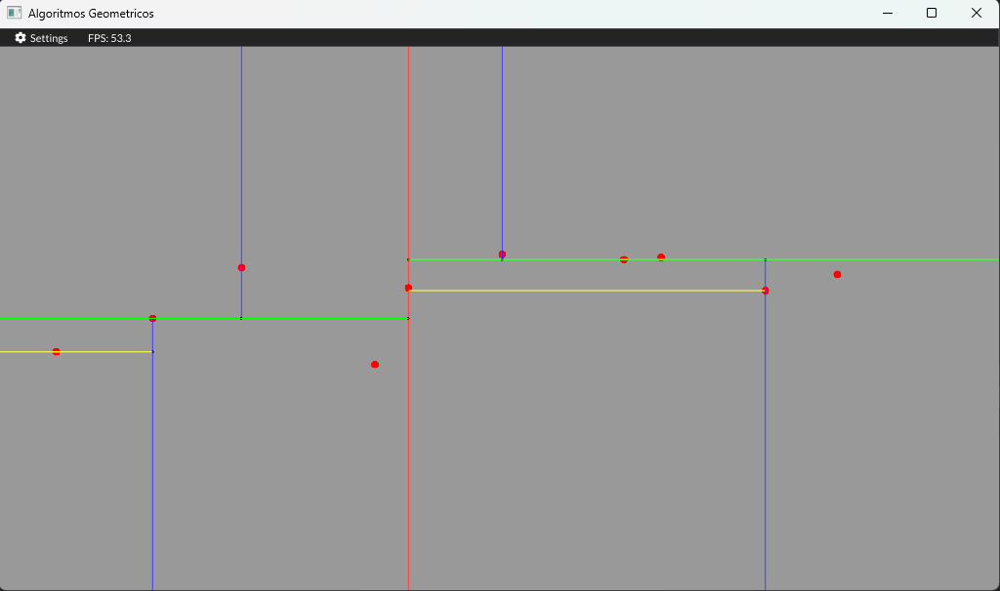
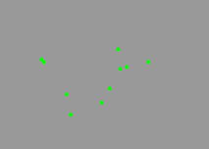
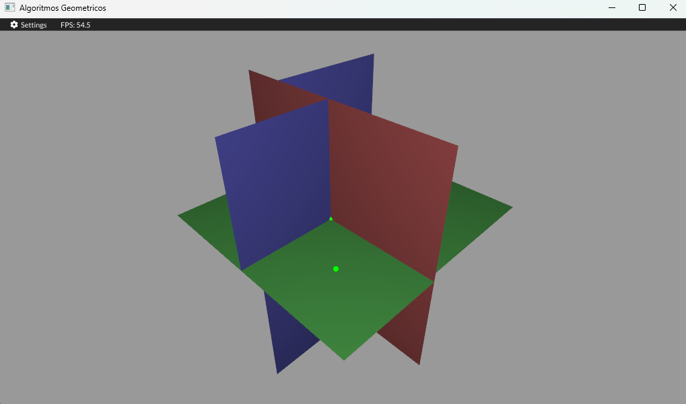

# KD-Tree
Implementation of the Kd-tree in 3D and 2D and visualisation of the same so that the different levels generated after its development can be seen. Implementation in C++/OpenGL. Final proyect for the subject Geometric Algorithms

## Local installation

If desired, the code can be executed locally. To do so, just execute the following commands:

For a Windows operating system
```bash
gh repo clone PabloLHo/KD-Tree
cd KD-Tree/Ejecutable
ejecutable.bat
```

For a Linux operating system
```bash
gh repo clone PabloLHo/KD-Tree
cd KD-Tree/Ejecutable
ejecutable.sh
```

## Development

The development of this project starts from the practice of a subject of Computer Engineering at the University of Jaén called Algortimos Geométricos, the code base of the interface is developed by the professors Lidia Ortega Alvarado, Alfonso Lopez Ruiz. As an addition to the initial work, a series of practices were developed and can be found in the following [repository](https://github.com/PabloLHo/Geometricos.git).

For the development of the data structure with tree format, we first developed the **2D format** where, given a cloud of points, we subdivide the points that are ordered by axes until we have only one left to generate a leaf. As divisors, we generate segments with the origin of the cutting point in the plane generated by the tree and as an end a point outside the range of the camera, except for cases that generate an intersection with another segment.

The development of the **3D-Tree** was very similar, as it was only necessary to abstract to a third dimension to be considered for the partitions, in addition, it was necessary to move to the use of dividing planes instead of segments. As a plane is infinite, its complexity was reduced to square polygons in order to deal with those cases that can produce intersection after multiple divisions as well as for a better visualisation from the observer's position.

## User Guide
Controls (Keys)
* 8: Randomize 2D cloud
* 9: Randomize 3D cloud
* +: Step by step kd tree visualization
* C: Full kd tree visualization

Camera
* W: Move forward
* A: Move left
* S: Move backwards
* D: Move to the right

It is necessary to hold down right click with these keys to move.

* X: Camera orbit movement, Y-axis rotation
* Y: Camera orbit movement, Z-axis rotation
* B: Reset camera to a home position
* Scroll: Zoom

Menu
* Rendering: Allows us to determine the types of topoligies to be observed as well as to determine the background of the scene.
* Models: Allows us to activate and deactivate the visualisation of the models in the scene as well as to edit them.
* Camera: Allows us to switch between the cameras available in the scene.
* Light: Allows us to change the components of the light as well as its position.
* Screenshot: Allows us to take a screenshot of the scene.
* KDTREE: Allows us to randomise 2D and 3D point clouds as well as determine the number of points that make them up.
<p align="center">
  
</p>


## Execution examples

### 2D-Tree and Point cloud
First we will present an example of the creation and visualisation of a **2D point cloud**.
<p align="center">
  
</p>


After this is displayed on the scene, we can generate the associated KD-Tree using the step-by-step format or a direct and complete creation, the result is shown below.
<p align="center">
  
</p>

### 3D-Tree and Point cloud
The most complex case of this data structure will be represented by the **3D-Tree**, whose point cloud is represented in green in the programme and if we do not find inside and move around we can observe the depth of the points.
<p align="center">
  
</p>


As in the 2D case we apply the KD-Tree visualisation processes and observe the following result.
<p align="center">
  
</p>

This result is a bit more complex to see as it requires more movement around the scene to see everything correctly.
